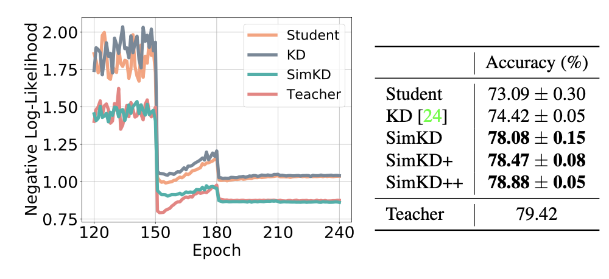

# SimKD

Knowledge Distillation with the Reused Teacher Classifier (CVPR-2022) https://arxiv.org/abs/2203.14001

# Toolbox for KD research

This repository aims to provide a compact and easy-to-use implementation of several representative knowledge distillation approaches on standard image classification tasks (e.g., CIFAR100, ImageNet). 

- Generally, these KD approaches include a **classification loss**, a **logit-level distillation loss**, and an additional **feature distillation loss**. For fair comparison and ease of tuning, *we fix the hyper-parameters for the first two loss terms as **one** throughout all experiments.* (`--cls 1 --div 1`)

- The following approaches are currently supported by this toolbox, covering vanilla KD, feature-map distillation/feature-embedding distillation, instance-level distillation/pairwise-level distillation:
  - [x] [Vanilla KD](https://arxiv.org/abs/1503.02531), [FitNet](https://arxiv.org/abs/1412.6550) [ICLR-2015], [AT](https://arxiv.org/abs/1612.03928) [ICLR-2017], [SP](https://arxiv.org/abs/1612.03928) [CVPR-2019], [VID](https://openaccess.thecvf.com/content_CVPR_2019/papers/Ahn_Variational_Information_Distillation_for_Knowledge_Transfer_CVPR_2019_paper.pdf) [CVPR-2019]
  - [x] [CRD](https://arxiv.org/abs/1910.10699) [ICLR-2020], [SRRL](https://openreview.net/forum?id=ZzwDy_wiWv) [ICLR-2021], [SemCKD](https://arxiv.org/abs/2012.03236) [AAAI-2021]
  - [ ] KR [CVPR-2021]
  - [x] [SimKD](https://arxiv.org/abs/2203.14001) [CVPR-2022] 

- This toolbox is built on a [open-source benchmark](https://github.com/HobbitLong/RepDistiller) and our [previous repository](https://github.com/DefangChen/SemCKD). The implementation of more KD approaches can be found there.

- Computing Infrastructure:
  - We use one NVIDIA GeForce RTX 2080Ti GPU for CIFAR-100 experiments. The PyTorch version is 1.0. We use four NVIDIA A40 GPUs for ImageNet experiments. The PyTorch version is 1.10.
  - As for ImageNet, we use [DALI](https://github.com/NVIDIA/DALI) for data loading and pre-processing. 

- The current codes have been reorganized and we have not tested them thoroughly. If you have any questions, please contact us without hesitation. 

- Please put the CIFAR-100 and ImageNet dataset in the `../data/`.

## Get the pretrained teacher models

```bash
# CIFAR-100
python train_teacher.py --batch_size 64 --epochs 240 --dataset cifar100 --model resnet32x4 --learning_rate 0.05 --lr_decay_epochs 150,180,210 --weight_decay 5e-4 --trial 0 --gpu_id 0

# ImageNet
python train_teacher.py --batch_size 256 --epochs 120 --dataset imagenet --model ResNet18 --learning_rate 0.1 --lr_decay_epochs 30,60,90 --weight_decay 1e-4 --num_workers 32 --gpu_id 0,1,2,3 --dist-url tcp://127.0.0.1:23333 --multiprocessing-distributed --dali gpu --trial 0 
```

The pretrained teacher models used in our paper are provided in this link [[GoogleDrive]](https://drive.google.com/drive/folders/1j7b8TmftKIRC7ChUwAqVWPIocSiacvP4?usp=sharing). 

## Train the student models with various KD approaches

```bash
# CIFAR-100
python train_student.py --path_t ./save/teachers/models/resnet32x4_vanilla/resnet32x4_best.pth --distill simkd --model_s resnet8x4 -c 0 -d 0 -b 1 --trial 0

# ImageNet
python train_student.py --path-t './save/teachers/models/ResNet50_vanilla/ResNet50_best.pth' --batch_size 256 --epochs 120 --dataset imagenet --model_s ResNet18 --distill simkd -c 0 -d 0 -b 1 --learning_rate 0.1 --lr_decay_epochs 30,60,90 --weight_decay 1e-4 --num_workers 32 --gpu_id 0,1,2,3 --dist-url tcp://127.0.0.1:23444 --multiprocessing-distributed --dali gpu --trial 0 
```
More scripts are provided in `./scripts`

## Some results on CIFAR-100

|    | ResNet-8x4 | VGG-8 | ShuffleNetV2x1.5 |
|  ----- | ----  | ----  | ---- |
| **Student**| 73.09 | 70.46 | 74.15 |
| KD     | 74.42 | 72.73 | 76.82 |
| FitNet | 74.32 | 72.91 | 77.12 |
| AT     | 75.07 | 71.90 | 77.51 |
| SP     | 74.29 | 73.12 | 77.18 |
| VID    | 74.55 | 73.19 | 77.11 |
| CRD    | 75.59 | 73.54 | 77.66 |
| SRRL   | 75.39 | 73.23 | 77.55 |
| SemCKD | 76.23 | 75.27 | 79.13 |
| SimKD (f=8) | **76.73** | 74.74 | 78.96|
| SimKD (f=4) | **77.88** | **75.62** | **79.48**|
| SimKD (f=2) | **78.08** | **75.76** | **79.54** |
| **Teacher (ResNet-32x4)** | 79.42 | 79.42 | 79.42 |



<center>(Left) The cross-entropy loss between model predictions and test labels. <br />
(Right) The top-1 test accuracy (%) (Student: ResNet-8x4, Teacher: ResNet-32x4). </center>


## Citation
If you find this repository useful, please consider citing the following paper:


```
@inproceedings{chen2022simkd,
  title={Knowledge Distillation with the Reused Teacher Classifier},
  author={Chen, Defang and Mei, Jian-Ping and Zhang, Hailin and Wang, Can and Feng, Yan and Chen, Chun},
  booktitle={Proceedings of the IEEE/CVF Conference on Computer Vision and Pattern Recognition},
  pages={11933--11942},
  year={2022}
}
```
```
@inproceedings{chen2021cross,
  author    = {Defang Chen and Jian{-}Ping Mei and Yuan Zhang and Can Wang and Zhe Wang and Yan Feng and Chun Chen},
  title     = {Cross-Layer Distillation with Semantic Calibration},
  booktitle = {Proceedings of the AAAI Conference on Artificial Intelligence},
  pages     = {7028--7036},
  year      = {2021},
}
```

